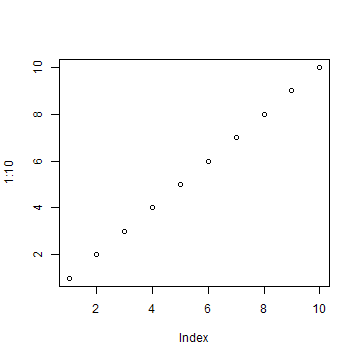
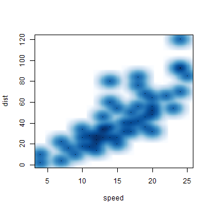

hi, report


```r
1 + 1
```

```
## [1] 2
```

```r
rnorm(10)
```

```
##  [1]  1.1832 -1.2700  0.2266 -0.6838  0.0102 -0.7522  0.1657  0.6618
##  [9]  0.7959 -1.0498
```

```r
pnorm(11)
```

```
## [1] 1
```


```r
plot(1:10)
```

 

```r
smoothScatter(cars)
```

```
## KernSmooth 2.23 loaded Copyright M. P. Wand 1997-2009
```

 


