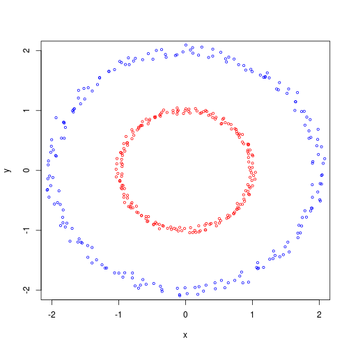
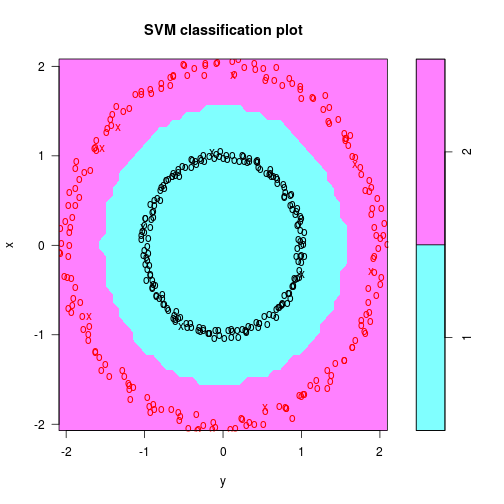

SVM的核方法补充老虎
========================================================
由于老虎讲SVM，但没有讲到核方法，我做了一些实验补充一下对非线性核方法的介绍。
(数学的推导过程，我确实也搞不定，就不列出来说了！)

下面是一个例子：
如果数据是呈现同心圆的分布，内圆是一类，外圆是另一类。那么对于这种非线性的分类，我们应该如何处理呢，用SVM的核方法，把数据升维考虑，我们就能找到完美的分类的解决方案。


```r
# install.packages('e1071',dependencies=TRUE)
library(e1071)
```

```
## Loading required package: class
```

```r
z = seq(0, 2 * pi, length = 200)
x = jitter(sin(z), 1, 0.05)
y = jitter(cos(z), 1, 0.05)

x2 = jitter(sin(z), 1, 0.05) * 2
y2 = jitter(cos(z), 1, 0.05) * 2
plot(x, y, cex = 0.6, col = "red", xlim = c(-2, 2), ylim = c(-2, 
    2))
points(x2, y2, cex = 0.6, col = "blue")
```

 

```r

df <- data.frame(x = c(x, x2), y = c(y, y2))
data <- cbind(df, c = c(rep(1, 200), rep(2, 200)))
model <- svm(c ~ ., data = data, type = "C-classification", kernel = "radial", 
    cost = 100, gamma = 0.1)
summary(model)
```

```
## 
## Call:
## svm(formula = c ~ ., data = data, type = "C-classification", 
##     kernel = "radial", cost = 100, gamma = 0.1)
## 
## 
## Parameters:
##    SVM-Type:  C-classification 
##  SVM-Kernel:  radial 
##        cost:  100 
##       gamma:  0.1 
## 
## Number of Support Vectors:  11
## 
##  ( 4 7 )
## 
## 
## Number of Classes:  2 
## 
## Levels: 
##  1 2
## 
## 
## 
```

```r
plot(model, data, x ~ y)
```

 


图如x的部分是支持向量，o的部分是普通的点
上图中已经完成完美的分类划分，核方法真是无比强大啊！

